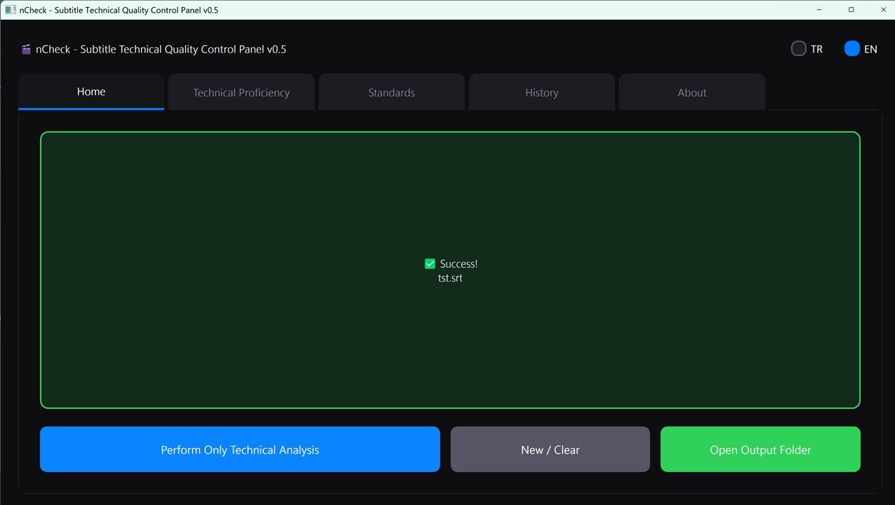
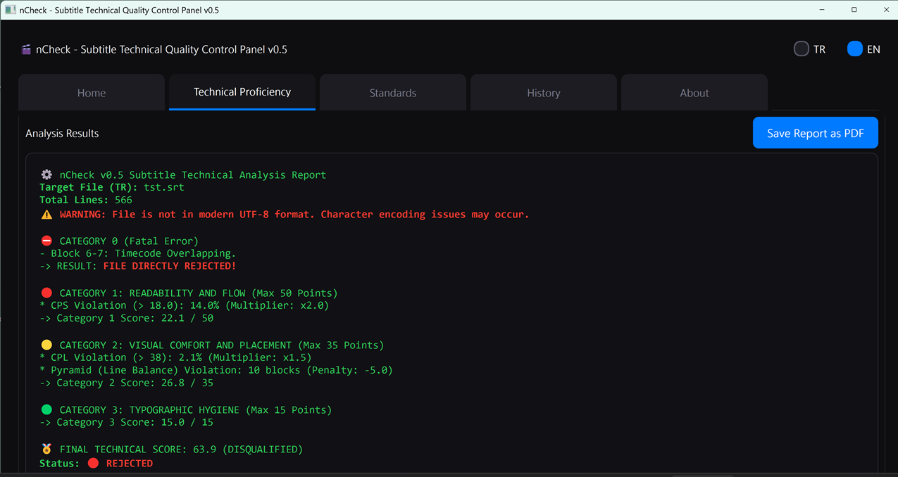

# 🎬 nCheck v0.5 - Autonomous Subtitle Technical Quality Control Panel

> **Technical inspection engine for SRT and ASS subtitle files based on MQM (Multidimensional Quality Metrics) standards.**

---

🇬🇧 **English** | [🇹🇷 Türkçe](README_TR.md)




## 📌 Overview

**Developer:** nutuzar
**Version:** v0.5 (Stable)
**License:** GPL-3.0

nCheck is a quality control (QC) tool that audits the technical compliance of SRT and ASS subtitle files according to international broadcasting standards (MQM). It does not interfere with the semantic or grammatical quality of the translation; its focus is strictly on **readability, visual ergonomics, and technical layout.**

Designed for those building massive subtitle archives, translators, and users looking to automate quality assurance (QA) workflows. It scans every loaded file to detect errors, calculates an objective quality score (0-100), and generates a print-ready PDF report.

---

## 🚀 Core Features

* **Autonomous Technical Analysis:** The moment a file is dragged and dropped, it scans thousands of lines within milliseconds, detects rule violations, and generates a detailed error log.
* **Strict Language Profiles:** Operates with locked background standards for Turkish (21 CPS / 40 CPL) and English (18 CPS / 38 CPL). It refuses to analyze files loaded with an incorrect language profile (e.g., loading an EN file while the TR profile is selected) and alerts the user.
* **Auto-QC PDF Certificate:** Upon each analysis, the application generates a PDF report formatted with static HTML tables to prevent layout shifting, featuring a stamp indicating the file's final status in the upper right corner.
* **Locked Standards Mode:** Threshold values (CPS, CPL, gap durations, etc.) are locked against external interference and accidental modifications. Only users with the authorized password can update the standards.
* **Typographical Warning System:** ANSI files that are not in the UTF-8 (BOM) standard do not crash the program; they are read silently, but a warning note is added to the very top of the generated report.

---

## 📊 Grading Scale

Based on the final calculated score (0-100), nCheck assigns one of the following classifications:

* `0 - 59` : 🔴 **REJECTED / POOR**
* `60 - 64`: 🟡 **MEDIOCRE**
* `65 - 69`: 🟡 **FAIR**
* `70 - 79`: 🟢 **WATCHABLE**
* `80 - 89`: 🟢 **GOOD**
* `90 - 94`: 🔵 **VERY GOOD**
* `95 - 100`: 🔵 **ARCHIVE QUALITY**

---

## 📜 nCheck Quality Evaluation Manifesto (MQM)

nCheck's scoring algorithm is based on global broadcast industry standards. The total 100 points are divided into three different centers of gravity (50%, 35%, 15%). Additionally, there is a Category 0 that operates independently of the score.

*(Note: Grammar and spell checking are not the responsibility of nCheck, but of **nSpell**, another application in the ecosystem.)*

### ⛔ CATEGORY 0: Critical Errors (Unscored / Direct Rejection)
Violations in this category break fundamental broadcasting standards. Even if a file scores 99, if it contains any of the following errors, it directly falls into the **REJECTED** status:
* **Timecode Overlapping:** A subtitle block starting before the previous one has ended.
* **Multi-Line Violation:** The presence of 3 or more lines in a single subtitle block on the screen.

### 🔴 CATEGORY 1: Readability and Flow (Maximum 50 Points)
Measures the viewer's capacity to read the text without detaching from the film's pacing.
* **CPS Violation:** Exceeding the maximum Characters Per Second reading limit.
* **Flash Subtitles:** Text remaining on the screen for a duration too short for the human eye to perceive (e.g., under 0.7s).
* **Zombie Subtitles:** Text remaining on the screen unnecessarily long (e.g., over 7.0s).

### 🟡 CATEGORY 2: Visual Comfort and Layout (Maximum 35 Points)
The space the text occupies on the screen and its potential to cause eye strain are evaluated in this category.
* **CPL Violation:** Exceeding the Characters Per Line limit.
* **Frame Gap Violation:** The flicker effect caused by failing to leave a sufficient gap (e.g., 24ms) between two consecutive subtitles.
* **Pyramid Rule Violation:** A drastic difference in character counts between the upper and lower lines in a two-line block (vertical imbalance).

### 🟢 CATEGORY 3: Typographical Hygiene (Maximum 15 Points)
Inspects the typographical craftsmanship of the file. Fixed penalties per violation are applied rather than proportional deductions.
* Unnecessary double spaces between words.
* Illegal spaces placed before punctuation marks.
* Unclosed or incorrectly written HTML formatting tags (e.g., `<i>`, `<b>`).
* Misuse of ellipses (...) or illegal symbol usage.

---

## 🛠️ Installation and Usage

**Requirements:**
* Python 3.8+
* PyQt5
* pysrt

**Installation:**
Install the required dependencies:
```bash
pip install PyQt5 pysrt