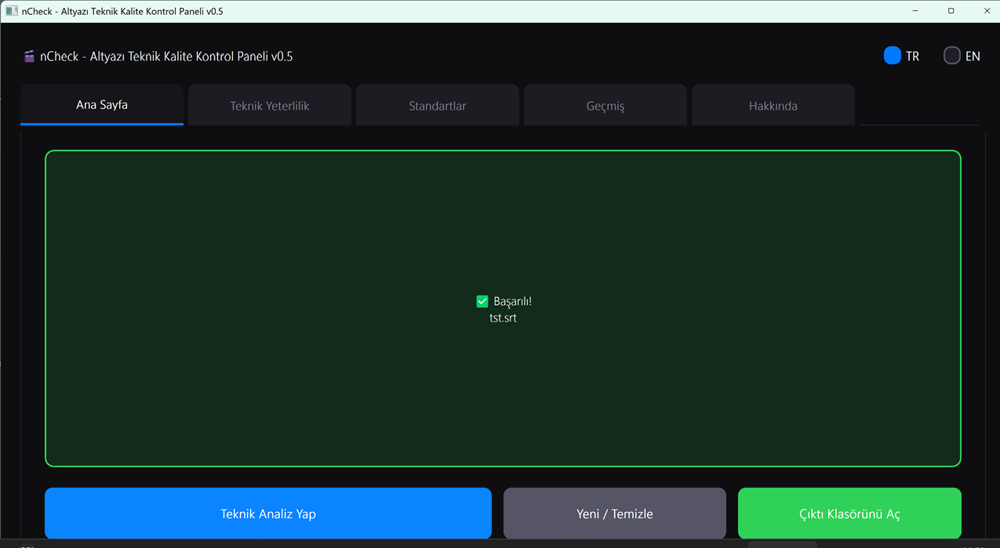
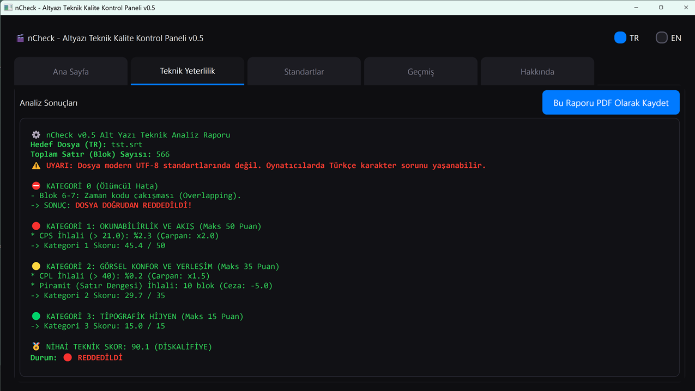

# 🎬 nCheck v0.5 - Otonom Altyazı Teknik Kalite Kontrol Paneli

> **MQM (Multidimensional Quality Metrics) standartlarını baz alan SRT ve ASS altyazı dosyaları için teknik denetim motoru.**

---

🇹🇷 **Türkçe** | [🇬🇧 English](README.md)




## 📌 Genel Bakış

**Geliştirici:** nutuzar
**Sürüm:** v0.5 (Kararlı)
**Lisans:** GPL-3.0

nCheck, SRT ve ASS formatındaki altyazı dosyalarının teknik yeterliliğini, uluslararası yayıncılık standartlarına (MQM) göre denetleyen bir kalite kontrol (QC) aracıdır. Çevirinin anlamsal veya dilbilgisi kalitesine müdahale etmez; odağı tamamen **okunabilirlik, görsel ergonomi ve teknik yerleşimdir.**

Devasa altyazı arşivleri oluşturanlar, çevirmenler ve kalite güvence (QA) süreçlerini otomatize etmek isteyen kullanıcılar için tasarlanmıştır. Yüklenen her dosyayı analiz ederek hataları tespit eder, objektif bir kalite skoru (0-100) hesaplar ve yazdırmaya hazır bir PDF raporu üretir.

---

## 🚀 Temel Özellikler

* **Otonom Teknik Analiz:** Dosyayı sürüklendiği an binlerce satırı milisaniyeler içinde tarar, kural ihlallerini tespit eder ve detaylı bir hata logu oluşturur.
* **Katı Dil Profilleri:** Arka planda kilitli Türkçe (21 CPS / 40 CPL) ve İngilizce (18 CPS / 38 CPL) standartlarıyla çalışır. Yanlış dil profili seçilerek yüklenen dosyaları (örn: TR seçiliyken EN dosya yüklenmesi) analiz etmeyi reddeder ve kullanıcıyı uyarır.
* **Auto-QC PDF Sertifikası:** Uygulama, her analiz sonucunda statik HTML tablolarıyla biçimlendirilmiş, kayma yapmayan ve sağ üst köşesinde dosyanın nihai durumunu gösteren mühür/kaşe bulunan bir PDF raporu üretir.
* **Şifreli Standartlar Modu:** Eşik değerleri (CPS, CPL, boşluk süreleri vb.) dış müdahalelere ve yanlışlıkla değiştirilmeye karşı kilitlidir. Yalnızca yetkili parolaya sahip kullanıcılar standartları güncelleyebilir.
* **Tipografik Uyarı Sistemi:** UTF-8 (BOM) standardında olmayan ANSI dosyaları programı çökertmez; sessizce okunur ancak üretilen raporun en tepesine uyarı notu düşülür.

---

## 📊 Derecelendirme Skalası

nCheck, dosyanın aldığı nihai puana göre (0-100) aşağıdaki sınıflandırmalardan birini atar:

* `0 - 59` : 🔴 **REDDEDİLDİ / YETERSİZ**
* `60 - 64`: 🟡 **VASAT**
* `65 - 69`: 🟡 **VASAT ÜSTÜ**
* `70 - 79`: 🟢 **İZLENEBİLİR**
* `80 - 89`: 🟢 **İYİ**
* `90 - 94`: 🔵 **ÇOK İYİ**
* `95 - 100`: 🔵 **ARŞİVLİK**

---

## 📜 nCheck Kalite Değerlendirme Manifestosu (MQM)

nCheck'in puanlama algoritması, küresel yayın endüstrisi standartlarına dayanır. Toplam 100 puan, üç farklı ağırlık merkezine (%50, %35, %15) bölünmüştür. Ayrıca skordan bağımsız çalışan bir "İnfaz Kurulu" (Kategori 0) mevcuttur.

*(Not: Dilbilgisi ve imla kontrolü nCheck'in değil, ekosistemin diğer parçası olan **nSpell** uygulamasının görevidir.)*

### ⛔ KATEGORİ 0: Kritik Hatalar (Puanlama Dışı / Doğrudan Ret)
Bu kategorideki ihlaller altyazının temel yayın standartlarını bozar. Bir dosya 99 puan bile alsa, aşağıdaki hatalardan birini barındırıyorsa doğrudan **REDDEDİLDİ** durumuna düşer:
* **Zaman Kodu Çakışması (Overlapping):** Bir altyazı bloğu bitmeden diğerinin başlaması.
* **Çoklu Satır İhlali:** Ekranda tek bir blokta 3 veya daha fazla satırın yer alması.

### 🔴 KATEGORİ 1: Okunabilirlik ve Akış (Maksimum 50 Puan)
İzleyicinin metni filmin temposundan kopmadan okuyabilme kapasitesini ölçer.
* **CPS İhlali:** Saniyede okunan karakter (Karakter/Saniye) limitinin aşılması.
* **Flaş Altyazılar:** Ekranda insan gözünün algılayamayacağı kadar kısa (örn: 0.7sn altı) kalan metinler.
* **Zombi Altyazılar:** Ekranda gereksiz yere uzun (örn: 7sn üstü) kalan metinler.

### 🟡 KATEGORİ 2: Görsel Konfor ve Yerleşim (Maksimum 35 Puan)
Metnin ekranda kapladığı alan ve gözü yorma potansiyeli bu kategoride değerlendirilir.
* **CPL İhlali:** Satır başına düşen karakter (Karakter/Satır) limitinin aşılması.
* **Frame Gap (Boşluk) İhlali:** İki altyazı arasında yeterli boşluğun (örn: 24ms) bırakılmaması sonucu oluşan titreme (flicker) etkisi.
* **Piramit (Satır Dengesi) İhlali:** İki satırlık bloklarda üst ve alt satırın karakter sayıları arasında uçurum olması (dikey dengesizlik).

### 🟢 KATEGORİ 3: Tipografik Hijyen (Maksimum 15 Puan)
Dosyanın tipografik işçiliğini denetler. Oran hesabı yerine ihlal başına maktu ceza kesilir.
* Kelimeler arası gereksiz çift boşluklar.
* Noktalama işaretlerinden önce bırakılan kuraldışı boşluklar.
* Kapatılmamış veya hatalı yazılmış HTML biçimlendirme etiketleri (`<i>`, `<b>` vb.).
* Üç nokta (...) istismarı veya kuraldışı sembol kullanımları.

---

## 🛠️ Kurulum ve Kullanım

**Gereksinimler:**
* Python 3.8 veya üzeri
* PyQt5
* pysrt

**Kurulum:**
Bağımlılıkları yükleyin:
```bash
pip install PyQt5 pysrt